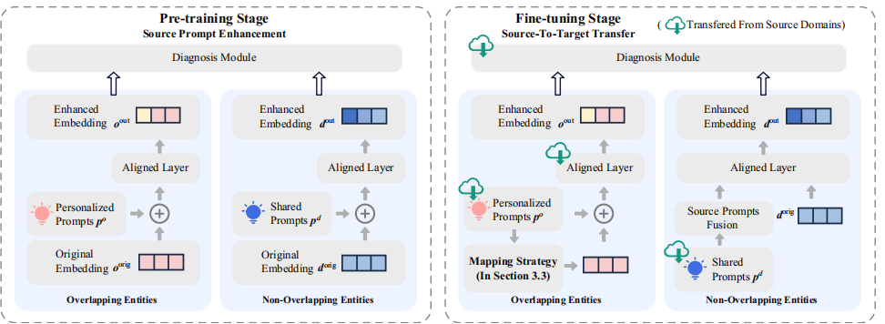
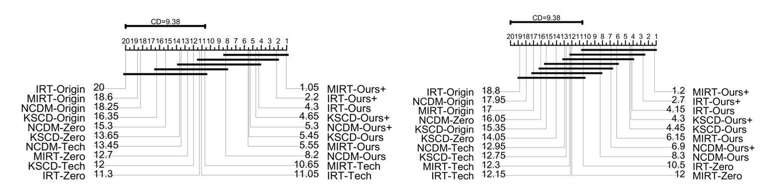
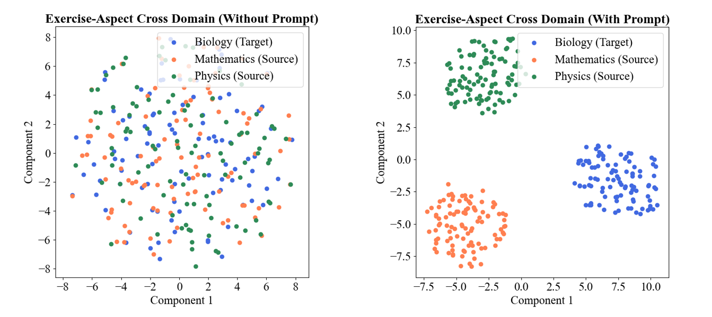

# PromptCD: Transferring Prompts for Cross Domain Cognitive Diagnosis 

This is the official PyTorch implementation of the paper "Transferring Prompts for Cross Domain Cognitive Diagnosis." In the paper, we address the issue of declining accuracy in cross-domain cognitive diagnosis (CDCD) by proposing a simple and generalizable cross-domain framework, PromptCD, aimed at achieving cross-domain cognitive diagnosis through soft prompt transfer. Our approach first learns general representations of entities in the source domain using soft prompts and then transfers these representations to the target domain model based on the characteristics of different entities, effectively utilizing the source domain data to capture underlying information. The process consists of two stages: pre-training and fine-tuning. In the pre-training stage, the prompts are updated using source domain data, and in the fine-tuning stage, the model parameters are adjusted with a small amount of target domain data to achieve knowledge transfer and adaptation.



Figure 1: Overall architecture of the proposed PromptCD framework, including the pre-training and fine-tuning stages.

## Table of Contents

- [Description](#description)
- [Install Dependencies](#install-dependencies)
- [Experimental Setup](#experimental-setup)
- [Usage Example](#usage-example)
- [Result Presentation](#result-presentation)
- [License](#license)

## Description 

This project provides the open-source code for the paper "Transferring Prompts for Cross Domain Cognitive Diagnosis," including datasets, model files, and running scripts used in the paper. Additionally, usage examples are provided to help users better understand and reproduce the experimental results.

## Install Dependencies

Install all necessary dependencies via `requirements.txt`:

```bash
pip install -r requirements.txt
```

## Experimental Setup

### Dataset Splitting
- The source domain dataset is split into 80% training set and 20% test set, using random seed 42.
- The target domain dataset randomly selects 20% of interaction records based on student IDs or item IDs as the fine-tuning dataset, and the remaining 80% is used as the test set, with random seed 2024. The fine-tuning dataset is further split into 90% training set and 10% validation set, using random seed 42.

### Model Training
- Both source domain training and target domain fine-tuning use a learning rate of `lr=0.001` and an early stopping mechanism.
- In source domain training, if the AUC of the validation set does not improve significantly (less than 0.001) for 5 consecutive epochs, training stops, with a patience of 5.
- The target domain fine-tuning also uses a patience of 5, stopping if the AUC does not improve for 5 consecutive epochs.
- Both the source domain training and target domain fine-tuning have a maximum of 100 training epochs.

## Usage Example


**1. Running a Specific Model**

If you want to run a specific model, execute the `main` file located in the `scripts` folder with the default parameters. For example:

```bash
python main_ncdm_cross_subject.py
```

**2. Running Multiple Models Simultaneously**

If you wish to run multiple models at once, modify the parameters in the `run_subject.sh` file. Select the desired scenarios and models to run, then execute the `run_subject.sh` script:

```bash
./run_subject.sh
```

## Paper Expansion

### Added Motivation Diagram

To strengthen our research motivation, we included discussions on the performance of deep learning-based cognitive diagnosis models, emphasizing the difficulties encountered in cross-domain cognitive diagnosis (CDCD) scenarios. Below is an example using the KSCD model:


<p align="center">
    <strong>Figure 1: KSCD Motivation diagram</strong>
    &nbsp;&nbsp;&nbsp;&nbsp;&nbsp;&nbsp;&nbsp;&nbsp;&nbsp;&nbsp;&nbsp;&nbsp;&nbsp;&nbsp;&nbsp;&nbsp;
    &nbsp;&nbsp;&nbsp;&nbsp;&nbsp;&nbsp;&nbsp;&nbsp;&nbsp;&nbsp;&nbsp;&nbsp;&nbsp;&nbsp;&nbsp;&nbsp;
    &nbsp;&nbsp;&nbsp;&nbsp;&nbsp;&nbsp;&nbsp;&nbsp;&nbsp;&nbsp;&nbsp;&nbsp;&nbsp;&nbsp;&nbsp;&nbsp;
    <strong>Table 1: Scenario Description</strong>
</p>

We conducted experiments on the KSCD model using the SLP dataset for both intra-domain (A and B) and cross-domain (C and D) scenarios. The results are summarized as follows: 1) The performance in C and D is worse than in A and B, indicating that traditional models do not perform well in CDCD scenarios; 2) The performance in A is worse than in B, showing that overfitting to limited data is a significant issue; 3) The performance in D is significantly worse than in C, due to the larger distribution differences between Chinese and Mathematics compared to Physics and Mathematics, highlighting the model's sensitivity to the source domain in CDCD scenarios.

### Added Significance Tests

We conducted Nemenyi tests on various baseline models used in different scenarios to report statistical significance for metrics such as AUC, ACC, RMSE, and F1. The specific results are as follows:

<p align="center">
  
</p>
<p align="center">
    <strong>Figure 3: AUC Significance Test</strong>
    &nbsp;&nbsp;&nbsp;&nbsp;&nbsp;&nbsp;&nbsp;&nbsp;&nbsp;&nbsp;&nbsp;&nbsp;&nbsp;&nbsp;&nbsp;&nbsp;
    &nbsp;&nbsp;&nbsp;&nbsp;&nbsp;&nbsp;&nbsp;&nbsp;&nbsp;&nbsp;&nbsp;&nbsp;&nbsp;&nbsp;&nbsp;&nbsp;
    &nbsp;&nbsp;&nbsp;&nbsp;&nbsp;&nbsp;&nbsp;&nbsp;&nbsp;&nbsp;&nbsp;&nbsp;&nbsp;&nbsp;&nbsp;&nbsp;
    <strong>Figure 4: ACC Significance Test</strong>
</p>

<br>

<p align="center">
  
</p>

<p align="center">
    <strong>Figure 5: RMSE Significance Test</strong>
    &nbsp;&nbsp;&nbsp;&nbsp;&nbsp;&nbsp;&nbsp;&nbsp;&nbsp;&nbsp;&nbsp;&nbsp;&nbsp;&nbsp;&nbsp;&nbsp;
    &nbsp;&nbsp;&nbsp;&nbsp;&nbsp;&nbsp;&nbsp;&nbsp;&nbsp;&nbsp;&nbsp;&nbsp;&nbsp;&nbsp;&nbsp;&nbsp;
    &nbsp;&nbsp;&nbsp;&nbsp;&nbsp;&nbsp;&nbsp;&nbsp;&nbsp;&nbsp;&nbsp;&nbsp;&nbsp;&nbsp;&nbsp;&nbsp;
    <strong>Figure 6: F1 Significance Test</strong>
</p>

From the analysis, we can see that the PromptCD model (especially the "Ours+" version) significantly outperforms other baseline models in multiple domains. This further validates the effectiveness and robustness of cross-domain prompt transfer methods in cognitive diagnosis tasks.

### Added Baseline Models Comparison

To provide a more comprehensive experiment, we included a comparison with the CCLMF baseline method. The results are as follows:

<div style="display: flex; justify-content: space-between; gap: 1px;">
  
  <div style="width: 30%;">
    <p><strong>Source:</strong> Mathematics, Physics<br><strong>Target:</strong> Biology</p>
    <table border="1" cellpadding="5" cellspacing="0" style="width: 100%; border-collapse: collapse;">
      <thead>
        <tr>
          <th>Metrics</th>
          <th>AUC</th>
          <th>ACC</th>
          <th>RMSE</th>
          <th>F1</th>
        </tr>
      </thead>
      <tbody>
        <tr><td><strong>IRT-Origin</strong></td><td>0.667</td><td>0.652</td><td>0.466</td><td>0.738</td></tr>
        <tr><td><strong>IRT-Tech</strong></td><td>0.779</td><td>0.729</td><td>0.421</td><td>0.800</td></tr>
        <tr><td><strong>IRT-Zero</strong></td><td>0.721</td><td>0.696</td><td>0.460</td><td>0.809</td></tr>
        <tr><td><strong>IRT-CCLMF</strong></td><td>0.775</td><td>0.723</td><td>0.425</td><td>0.808</td></tr>
        <tr><td><strong>IRT-Ours</strong></td><td>0.798</td><td>0.742</td><td><strong>0.411</strong></td><td>0.815</td></tr>
        <tr><td><strong>IRT-Ours+</strong></td><td><strong>0.799</strong></td><td><strong>0.743</strong></td><td><strong>0.411</strong></td><td><strong>0.816</strong></td></tr>
        <tr><td><strong>MIRT-Origin</strong></td><td>0.672</td><td>0.669</td><td>0.459</td><td>0.763</td></tr>
        <tr><td><strong>MIRT-Tech</strong></td><td>0.779</td><td>0.727</td><td>0.422</td><td>0.797</td></tr>
        <tr><td><strong>MIRT-Zero</strong></td><td>0.723</td><td>0.706</td><td>0.439</td><td>0.799</td></tr>
        <tr><td><strong>MIRT-CCLMF</strong></td><td>0.771</td><td>0.726</td><td>0.426</td><td>0.805</td></tr>
        <tr><td><strong>MIRT-Ours</strong></td><td>0.793</td><td>0.738</td><td>0.415</td><td><strong>0.816</strong></td></tr>
        <tr><td><strong>MIRT-Ours+</strong></td><td><strong>0.801</strong></td><td><strong>0.743</strong></td><td><strong>0.411</strong></td><td>0.809</td></tr>
        <tr><td><strong>NCDM-Origin</strong></td><td>0.706</td><td>0.655</td><td>0.456</td><td>0.724</td></tr>
        <tr><td><strong>NCDM-Tech</strong></td><td>0.780</td><td>0.727</td><td>0.421</td><td>0.795</td></tr>
        <tr><td><strong>NCDM-Zero</strong></td><td>0.734</td><td>0.697</td><td>0.437</td><td>0.792</td></tr>
        <tr><td><strong>NCDM-CCLMF</strong></td><td>0.765</td><td>0.731</td><td>0.424</td><td>0.811</td></tr>
        <tr><td><strong>NCDM-Ours</strong></td><td>0.785</td><td><strong>0.735</strong></td><td><strong>0.417</strong></td><td><strong>0.815</strong></td></tr>
        <tr><td><strong>NCDM-Ours+</strong></td><td><strong>0.788</strong></td><td>0.731</td><td>0.418</td><td>0.812</td></tr>
        <tr><td><strong>KSCD-Origin</strong></td><td>0.710</td><td>0.691</td><td>0.445</td><td>0.779</td></tr>
        <tr><td><strong>KSCD-Tech</strong></td><td>0.778</td><td>0.729</td><td>0.422</td><td>0.799</td></tr>
        <tr><td><strong>KSCD-Zero</strong></td><td>0.728</td><td>0.703</td><td>0.431</td><td>0.792</td></tr>
        <tr><td><strong>KSCD-CCLMF</strong></td><td>0.782</td><td>0.732</td><td>0.420</td><td>0.799</td></tr>
        <tr><td><strong>KSCD-Ours</strong></td><td>0.795</td><td><strong>0.741</strong></td><td><strong>0.413</strong></td><td><strong>0.818</strong></td></tr>
        <tr><td><strong>KSCD-Ours+</strong></td><td><strong>0.796</strong></td><td>0.739</td><td>0.414</td><td>0.812</td></tr>
      </tbody>
    </table>
  </div>
  
  <div style="width: 30%;">
    <p><strong>Source:</strong> B-bin, C-bin, D-bin<br><strong>Target:</strong> A-bin</p>
    <table border="1" cellpadding="5" cellspacing="0" style="width: 100%; border-collapse: collapse;">
      <thead>
        <tr>
          <th>Metrics</th>
          <th>AUC</th>
          <th>ACC</th>
          <th>RMSE</th>
          <th>F1</th>
        </tr>
      </thead>
      <tbody>
        <tr><td><strong>IRT-Origin</strong></td><td>0.670</td><td>0.800</td><td>0.393</td><td>0.884</td></tr>
        <tr><td><strong>IRT-Tech</strong></td><td>0.821</td><td>0.847</td><td>0.336</td><td>0.912</td></tr>
        <tr><td><strong>IRT-Zero</strong></td><td>0.855</td><td>0.854</td><td>0.324</td><td>0.917</td></tr>
        <tr><td><strong>IRT-CCLMF</strong></td><td>0.887</td><td>0.833</td><td>0.325</td><td>0.909</td></tr>
        <tr><td><strong>IRT-Ours</strong></td><td>0.871</td><td>0.867</td><td>0.316</td><td>0.922</td></tr>
        <tr><td><strong>IRT-Ours+</strong></td><td><strong>0.881</strong></td><td><strong>0.872</strong></td><td><strong>0.308</strong></td><td><strong>0.925</strong></td></tr>
        <tr><td><strong>MIRT-Origin</strong></td><td>0.718</td><td>0.820</td><td>0.372</td><td>0.896</td></tr>
        <tr><td><strong>MIRT-Tech</strong></td><td>0.820</td><td>0.845</td><td>0.339</td><td>0.912</td></tr>
        <tr><td><strong>MIRT-Zero</strong></td><td>0.841</td><td>0.841</td><td>0.347</td><td>0.902</td></tr>
        <tr><td><strong>MIRT-CCLMF</strong></td><td>0.834</td><td>0.849</td><td>0.331</td><td>0.911</td></tr>
        <tr><td><strong>MIRT-Ours</strong></td><td>0.861</td><td>0.859</td><td>0.324</td><td>0.917</td></tr>
        <tr><td><strong>MIRT-Ours+</strong></td><td><strong>0.886</strong></td><td><strong>0.872</strong></td><td><strong>0.311</strong></td><td><strong>0.923</strong></td></tr>
        <tr><td><strong>NCDM-Origin</strong></td><td>0.687</td><td>0.809</td><td>0.387</td><td>0.894</td></tr>
        <tr><td><strong>NCDM-Tech</strong></td><td>0.818</td><td>0.845</td><td>0.340</td><td>0.910</td></tr>
        <tr><td><strong>NCDM-Zero</strong></td><td>0.761</td><td>0.800</td><td>0.376</td><td>0.877</td></tr>
        <tr><td><strong>NCDM-CCLMF</strong></td><td>0.844</td><td>0.851</td><td>0.332</td><td>0.911</td></tr>
        <tr><td><strong>NCDM-Ours</strong></td><td><strong>0.879</strong></td><td><strong>0.866</strong></td><td><strong>0.316</strong></td><td><strong>0.918</strong></td></tr>
        <tr><td><strong>NCDM-Ours+</strong></td><td>0.878</td><td>0.865</td><td>0.319</td><td><strong>0.920</strong></td></tr>
        <tr><td><strong>KSCD-Origin</strong></td><td>0.764</td><td>0.831</td><td>0.368</td><td>0.901</td></tr>
        <tr><td><strong>KSCD-Tech</strong></td><td>0.809</td><td>0.848</td><td>0.338</td><td>0.913</td></tr>
        <tr><td><strong>KSCD-Zero</strong></td><td>0.778</td><td>0.806</td><td>0.346</td><td>0.877</td></tr>
        <tr><td><strong>KSCD-CCLMF</strong></td><td>0.854</td><td>0.855</td><td>0.327</td><td>0.915</td></tr>
        <tr><td><strong>KSCD-Ours</strong></td><td>0.875</td><td>0.865</td><td>0.312</td><td>0.921</td></tr>
        <tr><td><strong>KSCD-Ours+</strong></td><td><strong>0.880</strong></td><td><strong>0.868</strong></td><td><strong>0.310</strong></td><td><strong>0.923</strong></td></tr>
      </tbody>
    </table>
  </div>
  
</div>

The results, consistent with the previous analysis, show that the PromptCD model still has a significant performance advantage.

### Added Cross-Domain Scenarios

We added two new experiments: from humanities to sciences, and from sciences to humanities. Our results show that in both cases, PromptCD outperforms the comparison algorithms.

**The first four columns**: **Source:** Biology, Mathematics  **Target:** Geography
<br>
**The last four columns**: **Source:** Chinese, History  **Target:** Geography
| Metrics         | AUC   | ACC   | RMSE  | F1      | AUC   | ACC   | RMSE  | F1      |
|-----------------|-------|-------|-------|---------|-------|-------|-------|---------|
| **IRT-Origin**  | 0.677 | 0.650 | 0.472 | 0.721   | 0.687 | 0.659 | 0.465 | 0.731   |
| **IRT-Tech**    | 0.757 | 0.705 | 0.438 | 0.784   | 0.754 | 0.707 | 0.438 | 0.782   |
| **IRT-Zero**    | 0.734 | 0.693 | 0.446 | 0.776   | 0.760 | 0.705 | 0.437 | 0.780   |
| **IRT-CCLMF**   | 0.775 | 0.715 | 0.427 | 0.791   | 0.776 | 0.711 | 0.433 | 0.786   |
| **IRT-Ours**    | 0.791 | 0.726 | 0.422 | **0.795** | 0.783 | 0.722 | 0.425 | 0.790   |
| **IRT-Ours+**   | **0.792** | **0.727** | **0.421** | 0.792   | **0.787** | **0.724** | **0.424** | **0.793** |
| **MIRT-Origin** | 0.695 | 0.669 | 0.459 | 0.773   | 0.689 | 0.671 | 0.461 | 0.763   |
| **MIRT-Tech**   | 0.765 | 0.709 | 0.435 | 0.787   | 0.761 | 0.709 | 0.435 | 0.781   |
| **MIRT-Zero**   | 0.722 | 0.686 | 0.450 | 0.763   | 0.724 | 0.662 | 0.454 | 0.724   |
| **MIRT-CCLMF**  | 0.767 | 0.710 | 0.434 | 0.775   | 0.758 | 0.704 | 0.439 | 0.776   |
| **MIRT-Ours**   | 0.786 | 0.720 | 0.428 | **0.794** | 0.778 | 0.714 | 0.431 | **0.793** |
| **MIRT-Ours+**  | **0.791** | **0.728** | **0.423** | 0.789   | **0.792** | **0.728** | **0.422** | 0.787   |
| **NCDM-Origin** | 0.714 | 0.683 | 0.460 | 0.765   | 0.717 | 0.679 | 0.453 | 0.752   |
| **NCDM-Tech**   | 0.771 | 0.715 | 0.431 | 0.788   | 0.721 | 0.678 | 0.451 | 0.749   |
| **NCDM-Zero**   | 0.718 | 0.688 | 0.451 | 0.777   | 0.728 | 0.687 | 0.445 | 0.755   |
| **NCDM-CCLMF**  | 0.769 | 0.715 | 0.435 | 0.781   | 0.766 | 0.711 | 0.438 | 0.775   |
| **NCDM-Ours**   | 0.779 | 0.720 | 0.427 | **0.784** | 0.774 | 0.717 | 0.430 | 0.780   |
| **NCDM-Ours+**  | **0.786** | **0.722** | **0.424** | 0.783   | **0.786** | **0.720** | **0.426** | **0.783** |
| **KSCD-Origin** | 0.722 | 0.687 | 0.448 | 0.770   | 0.722 | 0.688 | 0.448 | 0.771   |
| **KSCD-Tech**   | 0.761 | 0.709 | 0.435 | 0.785   | 0.756 | 0.706 | 0.438 | 0.772   |
| **KSCD-Zero**   | 0.734 | 0.695 | 0.442 | 0.776   | 0.749 | 0.702 | 0.443 | 0.778   |
| **KSCD-CCLMF**  | 0.776 | 0.719 | 0.428 | 0.796   | 0.772 | 0.711 | 0.432 | 0.787   |
| **KSCD-Ours**    | **0.788** | **0.726** | **0.424** | 0.791   | 0.785 | **0.723** | **0.425** | 0.794   |
| **KSCD-Ours+**   | **0.788** | 0.724 | **0.424** | **0.794** | **0.787** | 0.719 | 0.426 | **0.797** |


**The first four columns**: **Source:** Chinese, History  **Target:** Physics
<br>
**The last four columns**: **Source:** Biology, Mathematics  **Target:** Physics
| Metrics        | AUC   | ACC   | RMSE  | F1     | AUC   | ACC   | RMSE  | F1     |
|----------------|-------|-------|-------|--------|-------|-------|-------|--------|
| **IRT-Origin** | 0.747 | 0.686 | 0.460 | 0.731  | 0.761 | 0.706 | 0.442 | 0.757  |
| **IRT-Tech**   | 0.829 | 0.753 | 0.407 | 0.791  | 0.845 | 0.767 | 0.397 | 0.808  |
| **IRT-Zero**   | 0.804 | 0.730 | 0.424 | 0.766  | 0.805 | 0.736 | 0.421 | 0.799  |
| **IRT-CCLMF**     | 0.844 | 0.762 | 0.399 | 0.810  | 0.850 | 0.761 | 0.403 | 0.813  |
| **IRT-Ours**   | **0.854** | 0.773 | **0.390** | **0.815** | 0.858 | 0.776 | 0.387 | 0.818  |
| **IRT-Ours+** | **0.854** | **0.774** | **0.390** | 0.814  | **0.864** | **0.781** | **0.384** | **0.823** |
| **MIRT-Origin**| 0.775 | 0.718 | 0.439 | 0.779  | 0.771 | 0.717 | 0.440 | 0.774  |
| **MIRT-Tech**  | 0.828 | 0.744 | 0.416 | 0.807  | 0.847 | 0.766 | 0.395 | 0.807  |
| **MIRT-Zero**  | 0.794 | 0.721 | 0.428 | 0.757  | 0.802 | 0.734 | 0.420 | 0.781  |
| **MIRT-CCLMF**    | 0.838 | 0.756 | 0.399 | 0.810  | 0.843 | 0.768 | 0.398 | 0.813  |
| **MIRT-Ours**  | 0.843 | 0.764 | 0.405 | **0.813** | 0.855 | 0.775 | 0.398 | **0.822** |
| **MIRT-Ours+**| **0.852** | **0.771** | **0.397** | 0.806  | **0.865** | **0.785** | **0.389** | 0.821  |
| **NCDM-Origin**| 0.782 | 0.721 | 0.435 | 0.764  | 0.790 | 0.725 | 0.432 | 0.771  |
| **NCDM-Tech**  | 0.821 | 0.743 | 0.414 | 0.799  | 0.797 | 0.732 | 0.423 | 0.784  |
| **NCDM-Zero**  | 0.798 | 0.729 | 0.426 | 0.787  | 0.791 | 0.714 | 0.438 | 0.746  |
| **NCDM-CCLMF**    | 0.831 | 0.754 | 0.408 | 0.791  | 0.839 | 0.769 | 0.403 | 0.809  |
| **NCDM-Ours**  | 0.832 | 0.757 | 0.407 | 0.806  | 0.848 | 0.764 | 0.397 | 0.796  |
| **NCDM-Ours+**| **0.848** | **0.769** | **0.397** | **0.814** | **0.861** | **0.782** | **0.386** | **0.820** |
| **KSCD-Origin**| 0.798 | 0.728 | 0.426 | 0.771  | 0.797 | 0.729 | 0.426 | 0.772  |
| **KSCD-Tech**  | 0.826 | 0.753 | 0.409 | 0.805  | 0.842 | 0.765 | 0.398 | 0.807  |
| **KSCD-Zero**  | 0.809 | 0.733 | 0.420 | 0.791  | 0.798 | 0.732 | 0.428 | 0.788  |
| **KSCD-CCLMF**    | 0.836 | 0.761 | 0.404 | 0.806  | 0.843 | 0.765 | 0.397 | 0.813  |
| **KSCD-Ours**  | 0.848 | 0.769 | 0.395 | 0.804  | 0.855 | **0.777** | **0.389** | **0.817** |
| **KSCD-Ours+**| **0.849** | **0.772** | **0.393** | **0.815** | **0.855** | 0.776 | **0.389** | **0.816** |


### Added Model Embedding Visualizations

For the exercise aspect in the CDCD scenario, the following figure shows the distribution of original exercise representations before introducing Prompt on the left, and the final representations after introducing Prompt on the right:

#### Exercise-aspect

<p align="center">
  
</p>
<p align="center">
    <strong>Figure 7: Before using Prompt</strong>
    &nbsp;&nbsp;&nbsp;&nbsp;&nbsp;&nbsp;&nbsp;&nbsp;&nbsp;&nbsp;&nbsp;&nbsp;&nbsp;&nbsp;&nbsp;&nbsp;
    &nbsp;&nbsp;&nbsp;&nbsp;&nbsp;&nbsp;&nbsp;&nbsp;&nbsp;&nbsp;&nbsp;&nbsp;&nbsp;&nbsp;&nbsp;&nbsp;
    &nbsp;&nbsp;&nbsp;&nbsp;&nbsp;&nbsp;&nbsp;&nbsp;&nbsp;&nbsp;&nbsp;&nbsp;&nbsp;&nbsp;&nbsp;&nbsp;
    &nbsp;&nbsp;&nbsp;&nbsp;&nbsp;&nbsp;
    <strong>Figure 8: After using Prompt</strong>
</p>

In addition, we introduced two quantitative metrics—inter-cluster distance and intra-cluster distance—to demonstrate the changes in student and exercise embedding vectors before and after introducing PromptCD. These metrics provide a clearer illustration of the effectiveness of our method and ensure consistency in our presentation on both aspects.

| Status | Dimension | Intra-cluster Distance | Inter-cluster Distance |
|------------------|--------------|------------------------|------------------------|
| Before Prompt | Exercise Embedding | 6.6352 | 0.2911 |
| Before Prompt | Student Embedding | 7.8856 | 0.6041 |
| After Prompt | Exercise Embedding | 2.8690 | 12.2945 |
| After Prompt | Student Embedding | 2.9120 | 13.0087 |

## License

This project is licensed under the MIT License.
